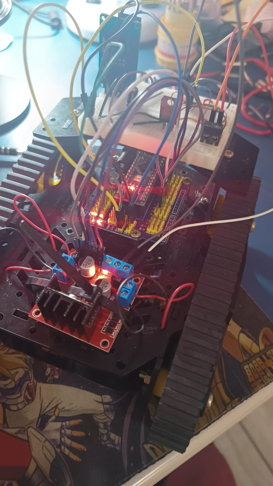
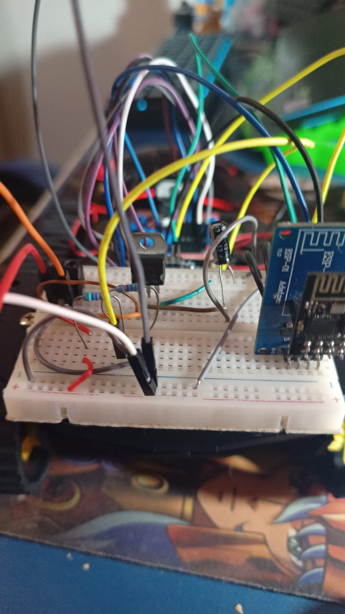

# SIMPLE ROBOT

## This robot is for entertainment purpose

## This example is created by http://arduino-skeleton-generator.boberto.net:3000/

## How this works?

1. The ESP 01 will accept incoming socket hand shakes acting like a slave.
2. The ESP 01 will send the received json to the arduino by serial communication.
3. The arduino will start the robot movements.

## Diagram 

Sooner or later will be here.

## Why are you describing with multiple models name?

This is because everytime i change the hardware, i will update the model version too.

This estructure was developed because i need to use Python with OpenCV to process models o cats. Detect my cat and try to distract him

# Changelog

19/05/2023 - Started changes on simple robot harware
20/05/2023 - Started battery implementantion
21/05/2023 - Added a init app with Flutter
21/05/2023 - Pause project by one week

# Postman example

# Model 2 ( ESP 01 and Arduino mega)

# Model 2 ( ESP 01 and Arduino mega)

# Model 2 ( ESP 01 and Arduino mega )

# Model 2 Beta ( ESP 01 and Arduino nano front )

# Model 2 Beta ( ESP 01 and Arduino nano back)

# Fun video while init tests

