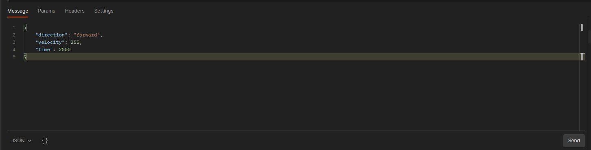
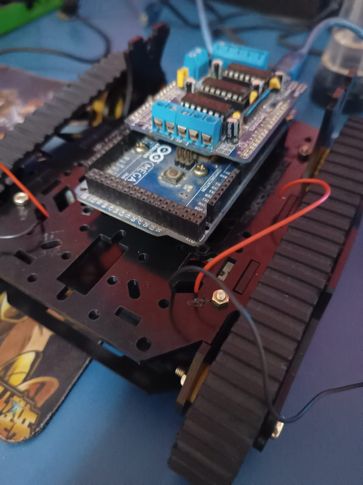
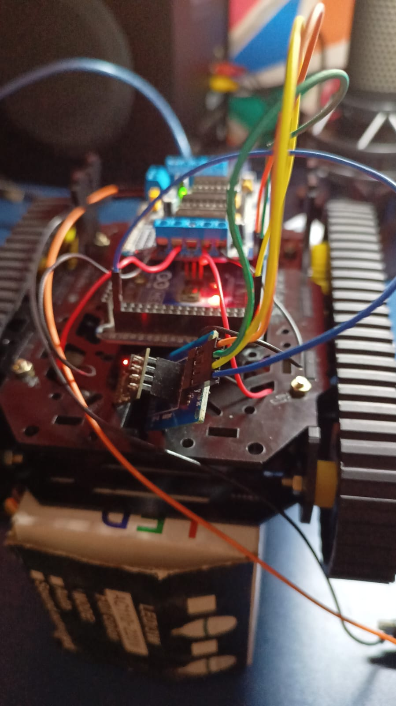
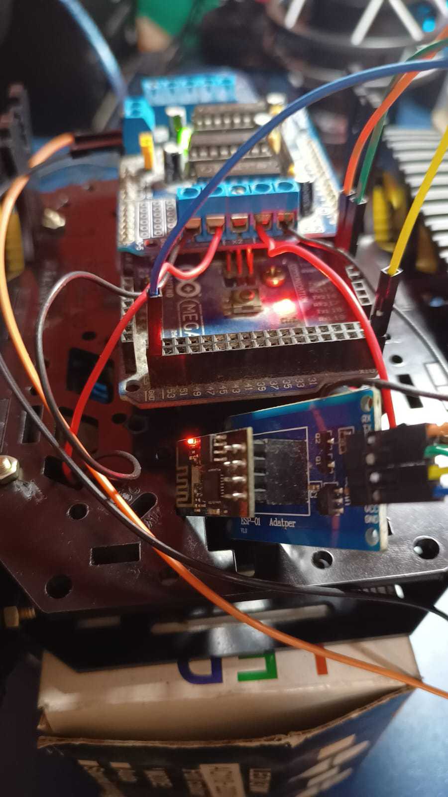

# SIMPLE ROBOT

## This robot is for entertainment purpose

## This example is created by http://arduino-skeleton-generator.boberto.net:3000/

## How this works?

1. The ESP 01 will accept incoming socket hand shakes acting like a slave.
2. The ESP 01 will send the received json to the arduino by serial communication.
3. The arduino will start the robot movements.

## Diagram 

Sooner or later will be here.

## Why are you describing with multiple models name?

This is because everytime i change the hardware, i will update the model version too.

This estructure was developed because i need to use Python with OpenCV to process models o cats. Detect my cat and try to distract him

# Postman array movements

# Model 2 ( ESP 01 )

# Model 2 ( ESP 01 )

# Model 2 ( ESP 01 )

# Fun video

<iframe width="560" height="315" src="https://www.youtube.com/embed/BU_s8jfL3HU" title="YouTube video player" frameborder="0" allow="accelerometer; autoplay; clipboard-write; encrypted-media; gyroscope; picture-in-picture; web-share" allowfullscreen></iframe>